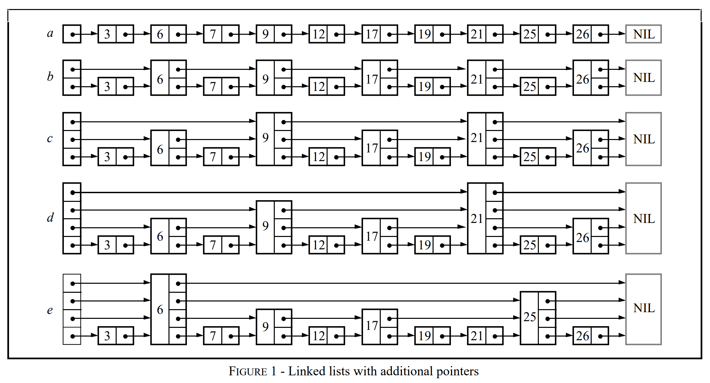
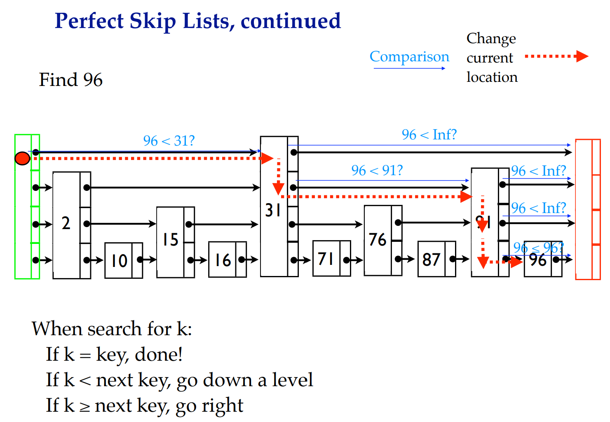

#### Data Structures

##### 1. Skip Lists

想一想数组和链表的优缺点。

| Operation                              | Array      | Linked List    |
| -------------------------------------- | ---------- | -------------- |
| Storage                                | Contiguous | Non-contiguous |
| Accessing an element                   | O(1)       | O(n)           |
| Searching for an element               | O(n)       | O(n)           |
| Inserting an element at the beginning  | O(n)       | O(1)           |
| Inserting an element at the end        | O(1)       | O(1)           |
| Deleting an element from the beginning | O(n)       | O(1)           |
| Deleting an element from the end       | O(1)       | O(n)           |

链表的明显短板是查找和访问。能否在有序情况下利用二分查找？

Skip List旨在在有序链表中实现跳跃访问。

<figure>
    
    <figcaption>Why SKip List?1 </figcaption>
</figure>

完美Skip List(Perfect Skip List)

- 键有序
- O(log n) 层
- 高层元素个数是下一层元素个数的一半
- Header(-\inf)和Sentinel(+\inf, 哨兵)横跨所有层
- 查找时间复杂度O(log n) （类二分查找）

但是

- 插入和删除可能需要重新安排整个结构
- Perfect Skip List 过于结构化，以至于更新低效

###### 解决方案

不再要求上层元素个数是下层元素个数的一半。相反，本层的每一个元素都有1/2的几率进入上一层。

因此，Skip List是一个随机化的数据结构，（同一序列的插入和删除可能产生不同的数据结构，取决于random coin flips）

Search Example:

<figure>
    
    <figcaption>Skip Lists Searching?2 </figcaption>
</figure>

复杂度证明与分析：

可参见[MIT skiplist](https://courses.csail.mit.edu/6.046/spring04/handouts/skiplists.pdf)

##### 2. B-tree

##### 3. LSM-tree

**参考**

<a id="1">[1]</a>William Pugh. 1990. Skip lists: a probabilistic alternative to balanced trees. Commun. ACM 33, 6 (June 1990), 668–676. https://doi.org/10.1145/78973.78977

<a id="2">[2]</a>https://www.cs.cmu.edu/~ckingsf/bioinfo-lectures/skiplists.pdf
