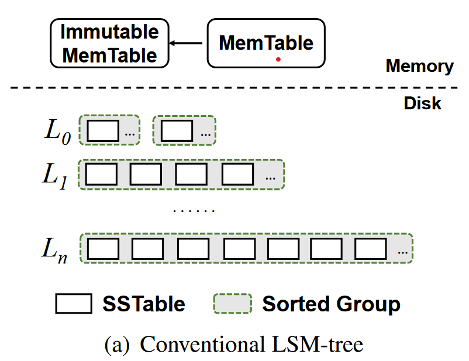

#### Differentiated Key-Value Storage Management for Balanced I/O Performance

*version-0.2*

> DiffKV, a novel LSM-tree KV store that aims for balanced performance in writes, reads, and scans.

##### Intro

Key-value storage three main operations

- writes, insert KV pairs

- reads, retrieve the value of a single key

- scans, retrieve the values over a key range

Efficiency of sequential I/Os && Data ordering for fast scans ---> ***Log-Structured-Merge-tree***， but suffer from high write and read amplifications.



Simple discription of LSM-tree storage structure

- It stores KV pairs **in entirety** as multiple disk files, called *SSTables*, in multiple levels. 

- Two in-memory write buffers, *MemTable*, *Immutable MemTable*.

- Flushing the Immutable MemTable to level *L*<sub>0</sub> on disk with append-only writes.

- All KV pairs in each of the levels from *L*<sub>1 </sub>to *L*<sub>n</sub> are fully sorted by keys for fast scans. *L*<sub>0</sub> are unsorted across different SSTables for fast flushed.
  
  （在L<sub>1</sub>至L<sub>n</sub>的每一层中KV对都是按键全排序的；L<sub>0</sub>不保证SSTable之间的顺序, 但每个SSTable内部仍是有序的）

###### Write process

```
KV pair ---> MemTable --full-> Immutable MemTable    (in-memory)
----------------------------------------|------------------------
                                        |            (out of memory)
                                    L0 SSTable    
                                        |
                                  n----full?----y---
                                                   | Compaction
                                               L1 SSTable
                                                    |
                                                  full?
                                                   ... 
```

How to compact a SSTable *S* in *L*<sub>i</sub> into *L*<sub>i+1</sub>?

The KV store reads *S* and all SSTables in *L*<sub>i+1</sub> that have overlapped key ranges with S, then sorts all  KV pairs by keys and creates new SSTables, then writes back into *L*<sub>i+1</sub>.

###### Read process

First, search in memory, not hit, then performs binary search in each level of the LSM-tree, from *L*<sub>0</sub> to *L*<sub>n</sub>. 在每一层，使用Bloom filter 查看是否存在该KV pair.

##### Motivation

Two directions of LSM-tree optimization

- **Relax the fully-sorted nature in each level of the LSM-tree.** 
  
  E.g. PebblesDB --- a fragmented LSM-tree
  
  使用*guards*将每层划分为几个不相交的groups. 同一group下的SSTables中的键范围可能重叠。
  
  将*L*<sub>i</sub>层中的一个组中的SSTables压缩至*L*<sub>i+1</sub>, 仅读取相应组中的SSTables，排序并存至*L*<sub>i+1</sub>, 不需读取*L*<sub>i+1</sub>层的内容. 大大减轻了compaction overhead.
  
  However, Sacrificing scan performance. (针对不同groups并行发射读—更多CPU资源消耗、有限提升)

- **KV separation**
  
  Keeping only keys in fully-sorted ordering in the LSM tree and performing value management in a dedicated storage area.
  
  pros: LSM-tree size decreases, suited for large-size values KV workloads.
  
  cons: For small-to-medium size values, degrades the scan performance. (Cause values over a key range are no longer fully sorted); incurs extra garbage collection overhead.

可能的优化：

1. 键和值的有序程度（the degrees of ordering in keys and values）. fully sorted/ partially sorted/ unsorted.

2. 针对不同大小的KV对的管理（KV pair: ..., large, medium, small, ...）

##### Methodology

DiffKV （区分的KV管理，既蕴含Key和Value的分离管理有序程度，又包含针对不同大小KV对的管理）

Two main ideas:

- Carefully coordinate the differentiated management of the ordering for keys and values. 
  
  - LSM-tree for \<key, v_loc\>, fully sorted
  
  - vTree for value management, partially-sorted values coordinate with respect to ordering of keys
    
    *Sorting of valuees in the vTree is triggered by the compaction of the LSM-tree.*

- Fine-grained KV separation, maintaining balanced performance under mixed workloads(KV pairs of different size groups)
