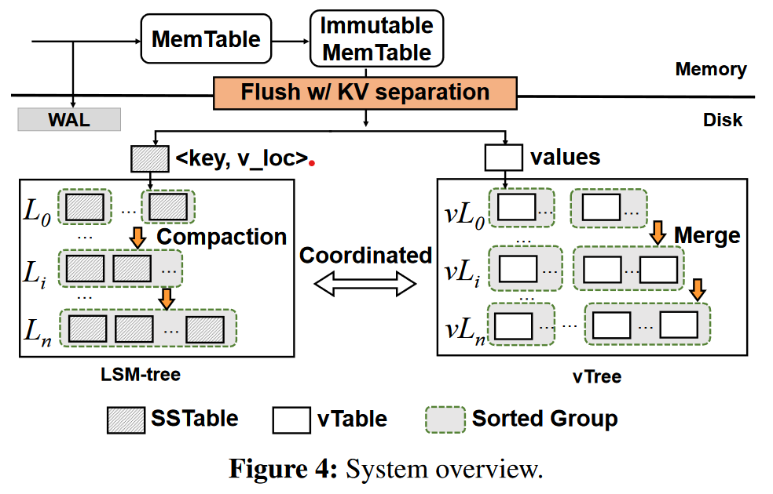
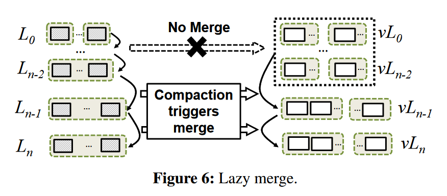
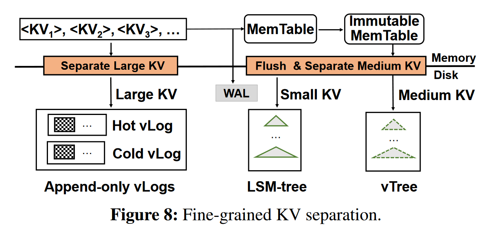
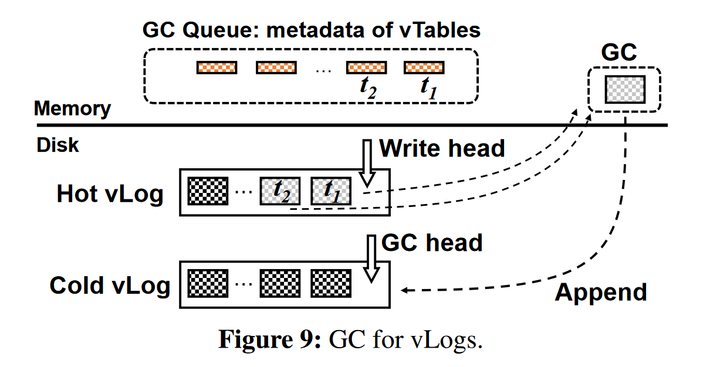

## Differentiated Key-Value Storage Management for Balanced I/O Performance


> DiffKV, a novel LSM-tree KV store that aims for balanced performance in writes, reads, and scans.

### Intro

Key-value storage three main operations

- writes, insert KV pairs

- reads, retrieve the value of a single key

- scans, retrieve the values over a key range

Efficiency of sequential I/Os && Data ordering for fast scans ---> ***Log-Structured-Merge-tree***， 

but suffer from high write and read amplifications.


Simple discription of LSM-tree storage structure

- It stores KV pairs **in entirety** as multiple disk files, called *SSTables*, in multiple levels. 

- Two in-memory write buffers, *MemTable*, *Immutable MemTable*.

- Flushing the Immutable MemTable to level *L*<sub>0</sub> on disk with append-only writes.

- All KV pairs in each of the levels from *L*<sub>1 </sub>to *L*<sub>n</sub> are fully sorted by keys for fast scans.

   *L*<sub>0</sub> are unsorted across different SSTables for fast flushed.
  
  （在L<sub>1</sub>至L<sub>n</sub>的每一层中KV对都是按键全排序的；L<sub>0</sub>不保证SSTable之间的顺序, 但每个SSTable内部仍是有序的）

#### Write process

```
KV pair ---> MemTable --full-> Immutable MemTable    (in-memory)
----------------------------------------|------------------------
                                        |            (out of memory)
                                    L0 SSTable    
                                        |
                                  n----full?----y---
                                                   | Compaction
                                               L1 SSTable
                                                    |
                                                  full?
                                                   ... 
```

How to compact a SSTable *S* in *L*<sub>i</sub> into *L*<sub>i+1</sub>?

The KV store reads *S* and all SSTables in *L*<sub>i+1</sub> that have overlapped key ranges with S, 

then sorts all  KV pairs by keys and creates new SSTables, then writes back into *L*<sub>i+1</sub>.

#### Read process

First, search in memory, not hit, then performs binary search in each level of the LSM-tree, 

from *L*<sub>0</sub> to *L*<sub>n</sub>. 在每一层，使用Bloom filter 查看是否存在该KV pair.

### Motivation

Two directions of LSM-tree optimization

- **Relax the fully-sorted nature in each level of the LSM-tree.** 
  
  E.g. PebblesDB --- a fragmented LSM-tree
  
  使用*guards*将每层划分为几个不相交的groups. 同一group下的SSTables中的键范围可能重叠。
  
  将*L*<sub>i</sub>层中的一个组中的SSTables压缩至*L*<sub>i+1</sub>, 仅读取相应组中的SSTables，排序并存至*L*<sub>i+1</sub>,

  不需读取*L*<sub>i+1</sub>层的与之有重叠的内容. 大大减轻了compaction overhead.
  
  However, Sacrificing scan performance. (针对不同groups并行发射读—更多CPU资源消耗、有限提升)

- **KV separation**
  
  Keeping only keys in fully-sorted ordering in the LSM tree and performing value management in a dedicated storage area.
  
  pros: LSM-tree size decreases, suited for large-size values KV workloads.
  
  cons: For small-to-medium size values, degrades the scan performance. (Cause values over a key range are no longer fully sorted);

  incurs extra garbage collection overhead.

可能的优化：

1. 键和值的有序程度（the degrees of ordering in keys and values）. fully sorted/ partially sorted/ unsorted.

2. 针对不同大小的KV对的管理（KV pair: ..., large, medium, small, ...）

### Methodology

DiffKV （区分的KV管理，既蕴含Key和Value的分离管理有序程度，又包含针对不同大小KV对的管理）

Two main ideas:

- **Carefully coordinate the differentiated management of the ordering for keys and values.** 
  
  - LSM-tree for \<key, v_loc\>, fully sorted
  
  - vTree for value management, partially-sorted values coordinate with respect to ordering of keys
    
    *Sorting of valuees in the vTree is triggered by the compaction of the LSM-tree.*

- **Fine-grained KV separation**, maintaining balanced performance under mixed workloads (KV pairs of different size groups)



#### Features

**vTable**, DiffKV organizes values as fixed size vTables. composed of:

- *data area*, values of KV pairs in a sorted order based on their keys

- *metadata area*, e.g. data size of vTable / smallest and largest keys of the values

**Sorted group**, a collection of vTables. The key ranges of any two vTables in a sorted group have no overlaps.

In DiffKV, all vTables generated in one flush form a sorted group,

use the number of sorted groups is an indicator of the degree of ordering in the vTree.（以vTree中有序组的个数来指示有序程度）

**vTree**

```
|                    vL0                    ]
|[***sg1]..[***sg8]  vL1     -- level       ] 
...                                         ] vtree
|                    vLn                    ]


// vtree consists of levels 
   level consists of sorted groups (not necessarily sorted)
   sorted group consists of vTables
   vTable consist of values
```

*Merge* operations are used to keep partially-sorted ordering for values which was triggered by

compaction operations in the LSM-tree in a coordinated manner. --- ***compaction-triggered merge***

Two benefits from ctm:

- efficient to identify valid values; 

- reduce overhead needed to maintain the latest value locations.

**Further Merge Optimizations**

每个compaction一个merge，太多了。

1. Lazy merge, 将*vL*<sub>0</sub>,...,*vL*<sub>n-2</sub>视作a single level，任何来自*L*<sub>0</sub>,...,*L*<sub>n-2</sub>的压缩不会引发归并，

  除非值需要归并到v*L*<sub>n-1</sub>.



2. Scan-optimized merge
   
   找出与许多其他vtables有重叠键范围的vtable，使之参与合并过程，增加vTree中值的有序度。

**垃圾回收**

回收无效值所占用的空间（在LSM-tree中，通过压缩回收无效值）

小优化：state awareness, Lazy GC 降低垃圾回收开销

#### 细粒度的KV分离



根据值的大小分为large, medium, small

- large KV pairs, 采用hotness-aware multi-log（v*Logs*）

- medium, values in vTree, \<key, v_loc\> in LSM-tree

- small, no KV separation, all in LSM-tree

vLog: 被设计成一个简单的循环append-only log，它由一组未排序的vtable组成。

热感知 vLogs: Hot vLog (Write head), Cold vLog(GC head)


