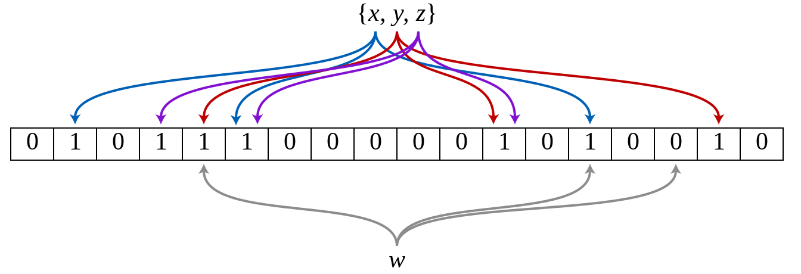
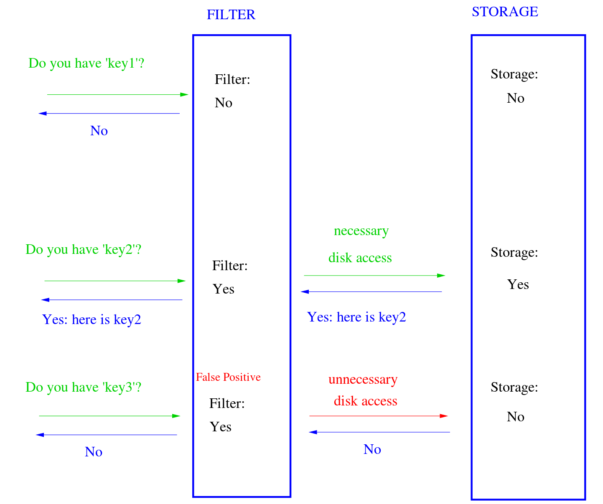
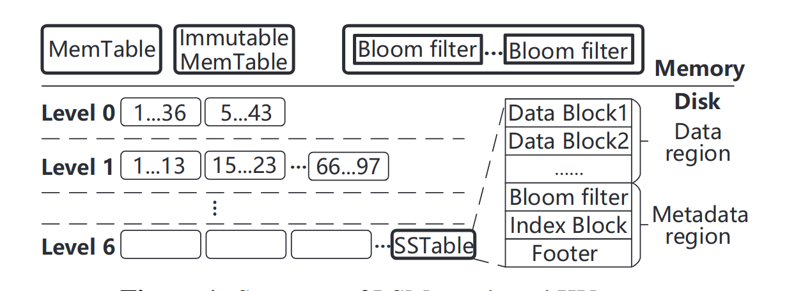
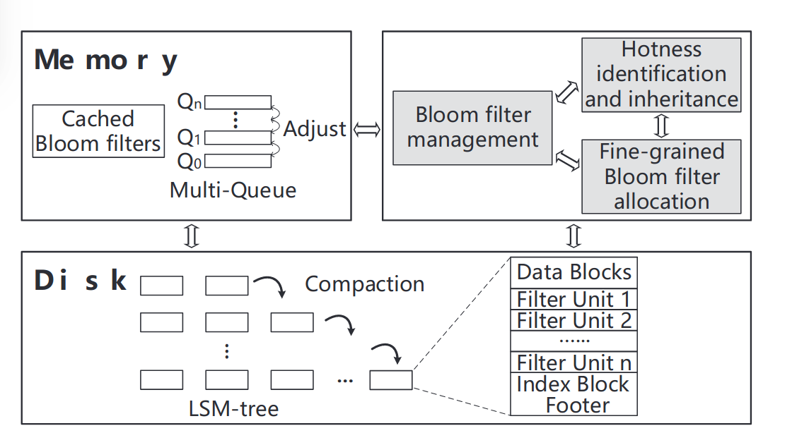
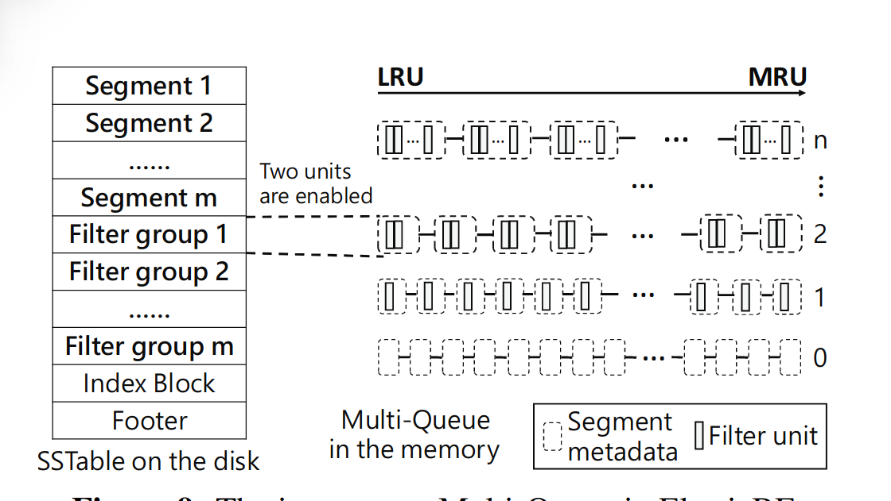
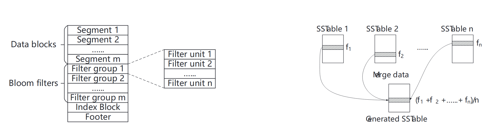

# ElasticBF

## Bloom filter

A Bloom filter is a space-efficient probabilistic data structure, conceived by Burton Howard Bloom in 1970, that is used to test whether an element is a member of a set. False positive matches are possible, but false negatives are not – in other words, a query returns either "possibly in set" or "definitely not in set". 

An empty Bloom filter is a bit array of m bits, all set to 0. There must also be k different hash functions defined, each of which maps or hashes some set element to one of the m array positions, generating a uniform random distribution. Typically, k is a small constant which depends on the desired false error rate ε, while m is proportional to k and the number of elements to be added.

To add an element, feed it to each of the k hash functions to get k array positions. Set the bits at all these positions to 1.

To query for an element (test whether it is in the set), feed it to each of the k hash functions to get k array positions. If any of the bits at these positions is 0, the element is definitely not in the set; if it were, then all the bits would have been set to 1 when it was inserted. If all are 1, then either the element is in the set, or the bits have by chance been set to 1 during the insertion of other elements, resulting in a false positive. In a simple Bloom filter, there is no way to distinguish between the two cases, but more advanced techniques can address this problem.

Bloom filters also have the unusual property that the time needed either to add items or to check whether an item is in the set is a fixed constant, O(k), completely independent of the number of items already in the set. No other constant-space set data structure has this property, but the average access time of sparse hash tables can make them faster in practice than some Bloom filters. In a hardware implementation, however, the Bloom filter shines because its k lookups are independent and can be parallelized
.

See <https://en.wikipedia.org/wiki/Bloom_filter> to know more about Bloom Filter.

---

## ElasticBF: Elastic Bloom Filter with Hotness Awareness for Boosting Read Performance in Large Key-Value Stores

#### Core idea:
We observe that access skewness is very common among SSTables or even small-sized segments within each SSTable.

To leverage this skewness feature, we develop ElasticBF, a fine-grained heterogerneous Bloom filter management scheme with dynamic adjustment according to data hotness.

一种细粒度的异构BloomFilter,可以根据数据热度进行动态调整。BF的设计和基于LSM-tree的KV存储是正交的，便于集成到已有的KV系统上。

#### How to get this idea?

LSM-tree结构的KV存储有着严重的写放大(300x)，当在KV存储中查找一个KV对时，需要从最低层次的level0一直检查到最高层次的leveln，直到找到该KV对或者所有的level都被检查完。每次检查KV到底在不在SSTable中时，需要读取多个SSTable中的元数据块。

为了减少检查多个SSTable带来的额外I/O,现代KV系统会利用Bloomfilter来快速检查在单个SSTable中是否存在某个KV对。

Bloomfilter虽然能快速检查，但存在假阳性现象，可能SSTable中不存在该KV对但仍会返回阳性，这就会产生不必要的I/O。

论文里为了验证BF的假阳率会产生多少不必要的I/O，在100GB的4-bits-per-key的KV存储中测试，结果是平均每次查找会检查7.6个SSTable，但其中1.3个是由于BF假阳造成的不必要I/O访问。

> 这个作者的思路很多时候都是，感觉哪个地方有能做的优化，那么设置某个实验来验证这个优化是否有效果，有多大效果。同时这个实验也是一种证明解决该问题存在合理的Motivation的方式,也让审稿人知道这个idea不是空穴来风拍脑子想出来的，而是来源于实践

传统的解决BF假阳率的办法是给每个key分配更多的bit,但这会使得BF的空间显著增大，10TB的KV，其中KV对大小100B，BF使用10bits-per-key的话，需要占用128GB的空间。

> 实验给出来说明问题存在后， 先提出传统的方法，再提出新方法

BF是个好东西，但是它的一个隐含假设其实是，对所有KV对的访问都是平均的，这样多个Hash出来的BF才不会浪费，也就是说，对所有KV的访问都有着一样的误报率。

但实际的使用中，数据存在明显的冷热数据区别，一些KV对是热数据，会被频繁访问，其他大部分的KV都很少被访问。

**那么思路就在这里了，BF不能太大，即每Key的bit数不能太高;同时提高每key的bit数可以降低假阳率；数据还有冷热之分。那我们为什么不能在保证BF大小限制的情况下，给那些热的KV对分配更多的bit，减少热数据的假阳率呢？**

热数据假阳率的降低会减少热数据的SSTable访问次数，减少磁盘的访问次数，提高上层应用的性能。

> 给出思路之后，给出引入新方法带来的代价

BF的设置不是那么容易调节的

1. 不同的level有着不同的访问不均匀性。尽管更低级别的KV对通常访问频率更高，但仍然有一部分更高level的SSTable明显比低level的SSTable更热。(论文2.2给出实验说明）

2. 即使在同一个SSTable中KV对，访问不均匀性也很严重。（2.2实验说明）

3. 最后，KV对的热点随着上层应用的运行会动态变化。

Monkey论文中提出的不均匀机制是他观察到更低级别的KV对访问平均来说比更高层次的更多，所以Monkey在BF中给更低level分配更多的位。但Monkey没有发现同一level里的访问也是不均匀的（讲了一把同行没想到的点，不过可能作者思路就是从Monkey来的），而且不能根据数据热点动态调整。

ElasticBF是一种细粒度弹性的Bloom filter管理机制。最基本的idea就是在构建SSTable时为每一组KV对分配多个小型的Bloomfilter,这些Bloomfiler驻留在磁盘中，并根据KV对的热度动态加载到内存中激活。

为了实现动态加载，需要解决：

1. 如何在低开销的情况下精确评估和记录KV对的热度

2. 如何在低开销的情况下根据热度动态改变Bloomfilter的能力

3. 在compaction重组SSTable的时候如何以较低的元数据开销高效继承上一层SSTable的热度。

#### Solution

ElasticBF的解决方案：

* fine-grained allocation：

KV对的热度在同一SSTable的不同范围内差异显著。因此将每个SSTable分成不同的段，在可接受存储和CPU开销下测量并记录热度，从而获得相对准确的热度估计，并实现细粒度的Bloomfilter分配。

* hotness inheritance：

通过继承过时的SSTables来估计compaction期间新SSTables的访问频率。避免由于compaction造成的热度频繁冷启动热度，持续提高读的性能。

> 其实是写了个compaction的时候热度处理的策略，这里可以参考，即如何统计管理SSTable内的热度，可能能用在其他地方。

* in-memory management optimization。

使用多队列的机制来管理内存中的Bloomfilter,使用并行的I/O来加速调整。以一个“较小”
的CPU开销，根据KV对的热度来动态调整内存中的Bloomfilter.

**CPU开销真的较小吗？**

#### Test Result

测试结果：
LevelDB,RocksD，PebblesDB,read thoughtput 2.34x 2.35x 2.58x, respectively,while keeps almost the same write performance.

mixed reads and writes, ElasticBF reduces read latency by 38.9%-51.8% without affecting writes.

compared with Monkey,ElasticBF achieves up to 2.20x throughput.

#### Design

ElasticBF主要包含三部分

* 细粒度的BF分配，fine-grained Bloom filter allocation

* 热度感知和继承，hotness identification and inheritance 

* 内存BF管理，Bloom filter management in memory

对于细粒度BF分配，首先需要解决，每个SSTable应该分配多少Bloom filter,每一个filter应该分配多少bit,以实现低误报率和低内存使用。也需要细致地设计低I/O开销的数据结构和管理机制。

对于热度感知，论文的目标是以较低开销实现相对准确的热度估计。

热度继承是为了避免在compaction之后热度感知的冷启动。

内存中Bloomfilter的管理是根据热度有效地调整Bloomfilter

整体的具体实现可以用这张图来讲清楚，首先我们将原来SSTable存KV对的数据区域分成m个Segment,每个Segment对应一个Filter group,而每个Filter group由若干个filter unit组成。这是在二级存储中的SSTable的改动。这是细粒度管理的基础结构。

接着为每一个Segment都设置一个热度变量，在上层应用运行的过程中动态改变，由此我们可以得到每个Segment的热度，同时设立热度继承机制，以在compaction之后避免新SSTable冷启动造成性能下降。

最后来看内存中添加的新结构，内存中维护一个多级队列，使用LRU调度。每次找key时lookup到某个SSTable，先把Filtergroup调到内存中，看这些Filter group里面能不能命中，开始时可能每个Segment对应的Filtergroup有几个默认的filter unit载入。运行一段时间后，根据热度数据，对热度高的Segment，将其提升到多级队列的高层，Filter group对应在多级队列的第i层，那么该Filtergroup对应的Segment就会有i个filter unit载入内存中。提到高层，使用的filter unit就多了，这样就会降低误报率。运行的时候，对于热度下降的Segment,会尝试将其Filtergroup移动到多级队列的下级，节省资源。

以上就是ElasticBF三个部分具体实现的简述

##### Q&A
>拆开的filter的与原来的Bloomfilter有什么联系？

>ElasticBF给每个SSTable用多个不同的独立Hash函数产生多个Bloomfilter，每个filter的位数小于bits-per-key,叫filter unit。
一个SSTable里的所有filter unit被称为filter group。假设来了一个key的查询，因为在一个group里的filter unit都是独立的，所以只要有一个filter单元返回negative,那么查询的key就必定不在这个SSTable中。只有所有的filter单元返回positive,，才需要读出SSTable来从中读取key。
可以证明,总共有着b bits-per-key的filter group的误报率和有着b bits-per-key的single Bloom filter误报率是相同的。

------

> 热度继承具体怎么做的？

>  热度的继承如图右侧所示，选取上一层的SSTable中有数据overlap的那些Segment对应的热度，做平均后给到新的SSTable,简单有效。

