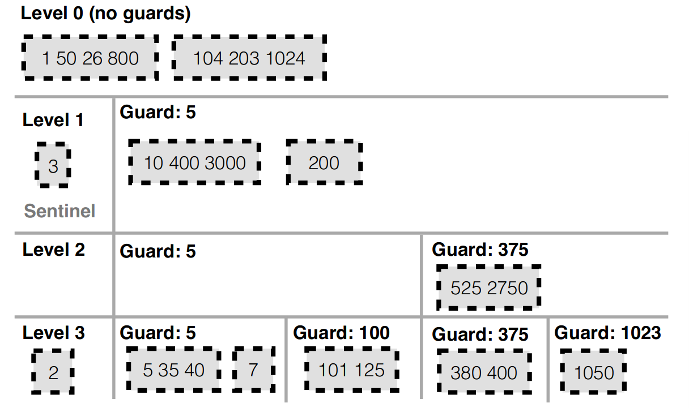

# PebblesDB

## PebblesDB:Building Key-Value Stores using Fragmented Log-Structured Merge Trees

写放大问题的根源是LSM-tree的数据结构本身。论文提出一种类似与Skip Lists的新LSM-tree数据结构，Fragment Log-Structured Merge Trees（FLSM）。FLSM引入了Guard的概念来组织日志，避免在同一级别重写数据。

## How to get this idea?
LSM-tree结构需要在维护数据的排序，从而实现数据的高效查询。但是插入新的数据时，现有的数据会被读出来重写以维持排序，从而会导致大量的写IO。

当写入一个KV导致第i层和第i+1 层的Compaction发生时，会把i+1层中和i层有数据重叠的SSTable读出来，和i层做排序后再写回i+1层。这个过程会在i+1层先读出后写入，在同一Level重写数据。

其实必要的数据写入就是i层写满了,把i层写到下一层。如果有一种方法，compaction 的时候只需要把上一层的数据写到下一层，不要把下层的数据读出再写入，那么就可以减少写放大。这就是Pebble的思路。

> 注意Wisckey的思路是把K和V分离，减少每一层的写入，PebblesDB是减少第i+1层的数据读出再写回，上一层次还是要把K和V一起写到下一层。把这两者综合一下。这里如果先做KV的分离，再用Pebbles的优化，引入的代价可能更大，应该也不会这么做。如果先用Pebbles的优化，再把KV分开，那这里就要考虑KV对的实际大小，这就是DiffKV的思路。

## Realize this idea

PebblesDB思路的具体实现是借助类似跳表的结构，如下图所示。

传统的LSM-tree树，有以下基本操作：

**Get()**

**Put()**

**Iterators()**

有Seek()和Next()，Seek(k)找到大于等于k的最小元素，Next()找到下一个元素。

**RangeQuery()** 

在每一层中，都在对应的SSTable中安排一个Iterator，最后将每一层的结果Merge得到范围查询的结果。

### FLSM

在FLSM结构中，将每一层的SSTable片段化，安排在Guard中，Guard之间没有overlap，Guard内的SSTable允许有overlap,插入KV对时有一定概率插入一个Guard。

这种结构Get的时候，会从Level 0 到Level n,每层读取的时候先在Guard中二分搜索到某个Guard,然后再在这个Guard中的每个SSTable中分别进行二分搜索。（或者先经过Bloomfilter），直到把每一层都搜完或者找到KV。

Put时与LSM-tree中一样，但在Compaction时，先将第i层的Guard中的SSTable进行Merge,然后按照插入KV对时插入的Guard和以前就在i+1层存在的Guard,把Merge后的结果分开，写入下一层。这个过程没有读取下一层的KV数据，直接把上一层的写入下一层。

> 注意这里不会随着写的越多，下层Guard里面的数据越来越碎片化，一个Guard里面的SSTable越来越多，因为插入KV对时有概率插入一个Guard,插入的Guard在Compaction到下一层的时候会正式投入使用，也就是说，一个Guard内的SSTable的数量大概是一致的，但越往下层走，Guard的数量越多，这种结构也就类似于跳表的样式。

RangeQuery的时候，首先在每一层中二分搜索到范围对应的那些Guard,然后在这些Guard里的每个SSTable中Seek(key1),找到大于等于key1的最小Key。接着在这些SSTable的Seek结果中Merge，这时一层的Query结果就有了。最后将每一层的结果再做一次Merge，返回结果给用户。

