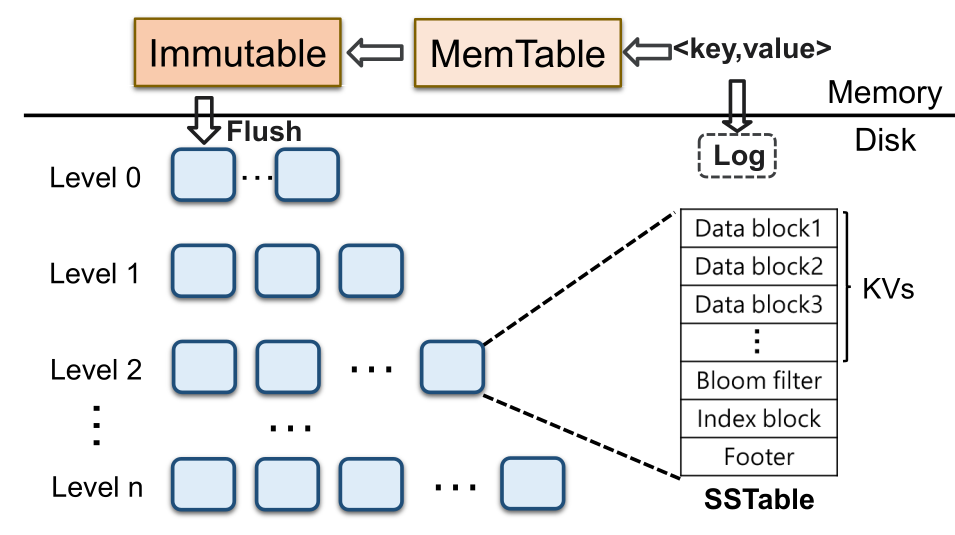

# K/V with LSM tree's Papers
记录正在读或者已经读过的Key Value键值存储系统的文章

## Why K/V?
With the exponential growth of data volume,traditional relational database meets challenges in scalability in dealing with extremely large-scale data.

Key-value stores have become a fundamental part of the infrastructure for modern systems. Much like how file systems are an integral part of operating systems, distributed systems today depend on key-value stores for storage.

数据呈指数增长，非结构化半结构化数据占数据总量80%以上。传统的存储系统面临挑战，传统文件系统需要对海量小文件进行目录树管理，其扩展性和元数据管理成为性能瓶颈。传统的关系型数据库适用于结构化数据，采用表格结构来存储和管理数据，难以水平扩展。
其他的存储模型主要有列式存储，文档存储，图存储和键值存储几类。其中键值存储满足现代数据特征的需求:
* 数据类型灵活<--数据类型繁多
* 高可扩展性<--数据体量巨大
* 读写效率高<--数据生成快速

As an alternative, key-value(KV) store is widely used as the fundamental storage infrastructure in many applications.

## Why LSM-tree?
According to the used index structures, KV stores can be categorized into **hash index** based design,**B-tree** based design and **LSM-tree** based design.
Because hash index based design requires large memory and can not well support range query,and B-tree based design involves an abundance of random writes, so most modern KV stores use LSM-tree, e.g.,LevelDB(Google),RocksDB(Facebook),Dynamo(Amazon),Cassandra(Apache).

## What's LSM-tree?
Log-Structured Merge-Tree

* 缓存排序，批量追加写
* 分层存储，容量递增
* 每层数据有序

Core idea:

1. 充分利用磁盘的顺序写，先写入缓存，缓存区满后批量追加写入磁盘

2. 保证每层数据的有序性。

数据在缓冲区内排序再Flush,保证SSTable内部有序。

外存中使用后台程序对层层写入的SSTable进行合并排序，保证SSTable间有序。

由于有序型，查找可以利用二分查找快速定位。

An LSM-tree based KV store is typically composed of two components.
One resides in memory to cache KV pairs, and it includes a MemTable and an Immutable MemTable. The other is stored insecondary storage, which is divide into multiple levels consisting of multiple SSTables.

Each SSTable contains a set of sorted KV pairs and necessary metadata.When a level reachese its size limit its SSTables will be compacted into the next levle via compaction, which first reads out the SSTables in the two levels, then performs a merge sort, and finally writes back the new SSTables into the next level.
**(This is the reason that compaction induces severe write amplification.)**

(Write amplification is the ratio of total write IO performed by the store to the total user data.)

When we lookup a KV pair,KV store needs to check multiple SSTables from the lowest level to the highest level until the key is found or all level have been checked.**(This ie the reason that LSM-tree based KV store suffer from read amplication)**

Furthermore, it is required to read multiple metadata blocks to really check whether a KV pair exists in one SSTable.

### 研究方向
1. 存储引擎优化
    * LSM-tree结构优化
    * 读写性能：读写放大，均衡，尾延迟，I/O竞争
    * SCAN优化
2. 索引结构
    * 学习索引
    * 传统索引:Tree、Trie、Hash
3. 分布式KV
    * 容错结合：多副本/EC纠删码
    * 均衡调度
4. 新型介质
    * PM非易失性内存
    * 网络介质RDMA：分离式架构
    * 云原生
5. 应用结合
    * DB：NewSQL
    * 图
    * 对象存储
    * ...

